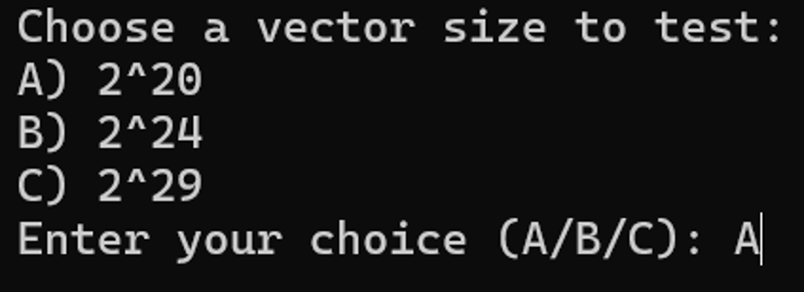
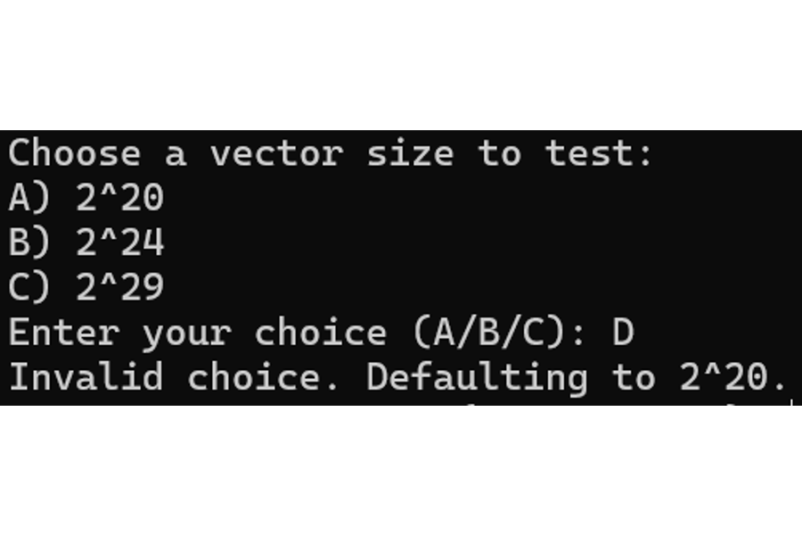
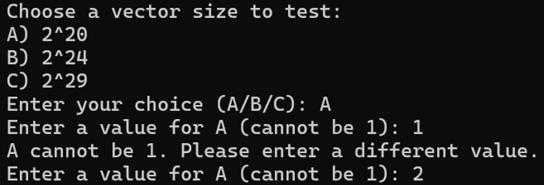
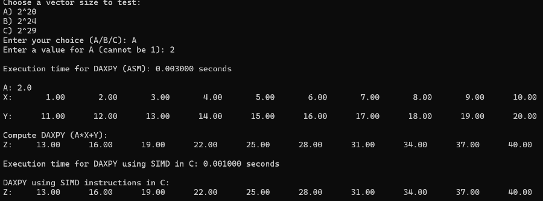
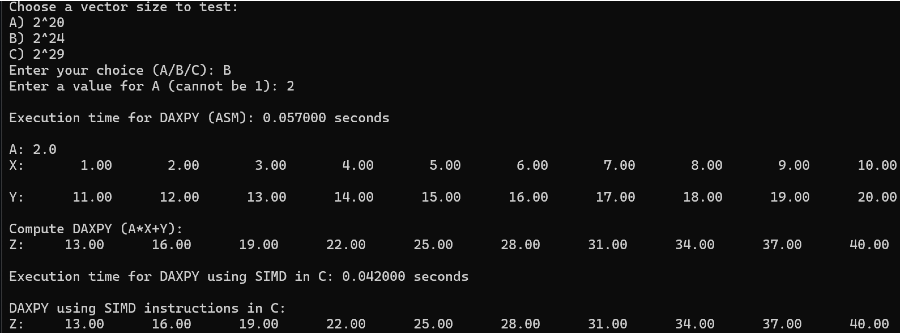
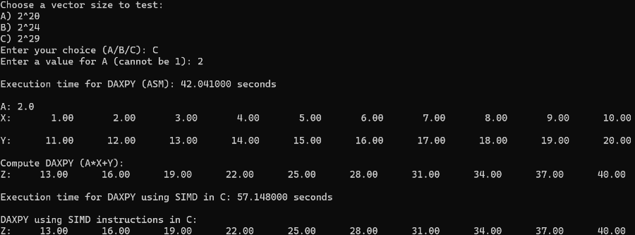

## LBYARCH - Grp 6
**Daxpy in C and x86**

Members: GUTIERREZ, ALLEN ANDREI DAGLE and STINSON, AUDREY LAUREN GARCIA

***

To run the program, open main.exe or input the following text in cmd:

1. nasm -f win64 daxpy.asm

2. gcc -c main.c -o main.obj -m64 -mavx 

3. gcc -o main.exe main.obj daxpy.obj -mconsole

4. main.exe

***

When you have excecuted the exe file it will first ask you to choose the size of the vector, the sizes being 2^20, 2^24 and 2^29.

The user must input the corresponding letter for the size of the vector. If the user entered an invalid input, it will automatically set the size of the vector to 2^20 as seen in the image below.

**Image of the size selection:**

Invalid Input:

***

After selecting the size of the vector it will then ask you for a number. That number will be the one used as the value for the variable A. The entered value cannot be 1. If the value 1 is entered as the input, the program will say it can't be 1 and loop back to ask for a new input.

**Image of User input for A:**

***

Now the program will execute the Daxpy Operation done in assembly, calculate and print out the execution time, and then print out the first 10 elements of all vectors. After that, it will execute and print out the Daxpy done using SIMD instructions in C to visibly check if the outputs of the assembly are correct.

**Sample runs of different vector Sizes:**

***
**Run time Results**

In this section we will see the time it took for the program to complete computing for the Daxpy. We will conduct 30 test runs for each size before we compute for the average run time.

**Vector Size: 2^20**
| Test no:           | asm time in Seconds: | C time in Seconds: |
|:------------------:|:--------------------:|:---------------------:|
| 1                  | 0.003000             | 0.001000              |
| 2                  | 0.001000             | 0.001000              |
| 3                  | 0.004000             | 0.002000                    |
| 4                  | 0.005000                   | 0.003000                    |
| 5                  | 0.002000                   | 0.005000                    |
| 6                  | 0.005000                   | 0.004000                    |
| 7                  | 0.005000                   | 0.004000                    |
| 8                  | 0.003000                   | 0.002000                    |
| 9                  | 0.004000                   | 0.003000                    |
| 10                 | 0.002000                   | 0.003000                    |
| 11                 | 0.003000                   | 0.003000                    |
| 12                 | 0.002000                   | 0.003000                    |
| 13                 | 0.002000                   | 0.003000                    |
| 14                 | 0.004000                   | 0.003000                    |
| 15                 | 0.003000                   | 0.003000                    |
| 16                 | 0.001000                   | 0.004000                    |
| 17                 | 0.002000                   | 0.003000                    |
| 18                 | 0.002000                   | 0.003000                    |
| 19                 | 0.004000                   | 0.004000                    |
| 20                 | 0.002000                   | 0.003000                    |
| 21                 | 0.004000                   | 0.003000                    |
| 22                 | 0.002000                   | 0.003000                    |
| 23                 | 0.005000                   | 0.005000                    |
| 24                 | 0.004000                   | 0.006000                    |
| 25                 | 0.002000                   | 0.004000                    |
| 26                 | 0.002000                   | 0.001000                    |
| 27                 | 0.004000                   | 0.002000                    |
| 28                 | 0.004000                   | 0.005000                    |
| 29                 | 0.003000                   | 0.002000                    |
| 30                 | 0.003000                   | 0.003000                    |
| **Avg Time**           | **0.00323**                   | **0.00287**                    |

**Vector Size: 2^24**
| Test no:           | asm time in Seconds: | C time in Seconds: |
|:------------------:|:--------------------:|:---------------------:|
| 1                  | 0.057000             | 0.042000              |
| 2                  | 0.039000             | 0.041000              |
| 3                  | 0.044000             | 0.037000                    |
| 4                  | 0.051000                   | 0.041000                    |
| 5                  | 0.041000                   | 0.040000                    |
| 6                  | 0.065000                   | 0.045000                    |
| 7                  | 0.055000                   | 0.045000                    |
| 8                  | 0.060000                   | 0.043000                    |
| 9                  | 0.071000                   | 0.044000                    |
| 10                 | 0.044000                   | 0.043000                    |
| 11                 | 0.038000                   | 0.039000                    |
| 12                 | 0.048000                   | 0.042000                    |
| 13                 | 0.055000                   | 0.039000                    |
| 14                 | 0.052000                   | 0.041000                   |
| 15                 | 0.044000                     | 0.040000                       |
| 16                 | 0.041000                     | 0.040000                       |
| 17                 | 0.042000                     | 0.042000                       |
| 18                 | 0.043000                     | 0.042000                       |
| 19                 | 0.046000                     | 0.044000                       |
| 20                 | 0.039000                     | 0.040000                       |
| 21                 | 0.041000                     | 0.046000                       |
| 22                 | 0.057000                     | 0.041000                       |
| 23                 | 0.044000                     | 0.049000                       |
| 24                 | 0.042000                     | 0.039000                       |
| 25                 | 0.042000                     | 0.044000                       |
| 26                 | 0.040000                     | 0.042000                       |
| 27                 | 0.044000                     | 0.037000                       |
| 28                 | 0.039000                     | 0.039000                       |
| 29                 | 0.045000                     | 0.040000                       |
| 30                 | 0.042000                     | 0.040000                       |
| **Avg Time**           | **0.0416**                   | **0.0416**                    |

**Vector Size: 2^29**
| Test no:           | asm time in Seconds: | C time in Seconds: |
|:------------------:|:--------------------:|:---------------------:|
| 1                  | 42.041000                     | 57.148000                       |
| 2                  | 42.940000                     | 59.400000                       |
| 3                  | 37.132000                     | 56.224000                       |
| 4                  | 21.885000                     | 54.917000                       |
| 5                  | 37.640000                     | 66.159000                       |
| 6                  | 29.915000                     | 62.287000                       |
| 7                  | 32.399000                     | 70.241000                       |
| 8                  | 37.164000                     | 56.794000                       |
| 9                  | 33.811000                     | 60.387000                       |
| 10                 | 42.167000                     | 57.843000                       |
| 11                 | 34.352000                     | 59.591000                       |
| 12                 | 36.815000                     | 57.233000                       |
| 13                 | 37.231000                     | 72.180000                       |
| 14                 | 37.517000                     | 62.659000                       |
| 15                 | 38.916000                     | 61.109000                       |
| 16                 | 35.209000                     | 59.417000                       |
| 17                 | 37.808000                     | 61.844000                       |
| 18                 | 43.736000                     | 61.006000                       |
| 19                 | 43.553000                     | 57.409000                       |
| 20                 | 42.823000                     | 63.961000                       |
| 21                 | 35.584000                     | 67.265000                       |
| 22                 | 41.711000                     | 60.882000                       |
| 23                 | 37.627000                     | 58.097000                       |
| 24                 | 38.443000                     | 58.337000                       |
| 25                 | 39.551000                     | 66.014000                       |
| 26                 | 31.992000                     | 57.978000                       |
| 27                 | 43.618000                     | 57.823000                       |
| 28                 | 37.897000                     | 60.501000                       |
| 29                 | 41.710000                     | 59.124000                       |
| 30                 | 45.415000                     | 58.437000                       |
| **Avg Time**       | **37.561200**                 | **57.930067**                   |

***
**Comparative Execution Time Analysis**
### Vector Size: 2^20

- **Average ASM Time**: 0.00323 seconds
- **Average C Time**: 0.00287 seconds
- **Performance Comparison**:  
  The C kernel demonstrates slightly faster execution compared to the ASM kernel. On average, C outperforms ASM by about **0.00036 seconds**, making it a better option for smaller vector sizes. This suggests that C’s parallel processing capabilities provide a slight advantage over the scalar approach in the given range.

### Vector Size: 2^24

- **Average ASM Time**: 0.0416 seconds
- **Average C Time**: 0.0416 seconds
- **Performance Comparison**:  
  For vector size 2^24, both the ASM and C kernels exhibit nearly identical execution times, with an average difference of **0.0000 seconds**. This suggests that for medium-sized vectors, the parallel processing capabilities of C do not provide a significant advantage over the scalar approach, and both methods perform similarly in this range.

### Vector Size: 2^29

- **Average ASM Time**: 37.5612 seconds
- **Average C Time**: 57.9301 seconds
- **Performance Comparison**:  
  For vector size 2^29, the **ASM kernel performs significantly faster** than the C kernel, with an average time difference of approximately **20.37 seconds**. This indicates that for larger vector sizes, C may not always be more efficient and could incur additional overhead due to its parallel processing nature. The scalar approach (ASM) is more efficient at handling larger data in this case.
***
[Click me for video demo!](https://drive.google.com/file/d/1CuY-Gxv6iPpd-i07MLN3UYOumUeLCS0S/view?usp=sharing)

